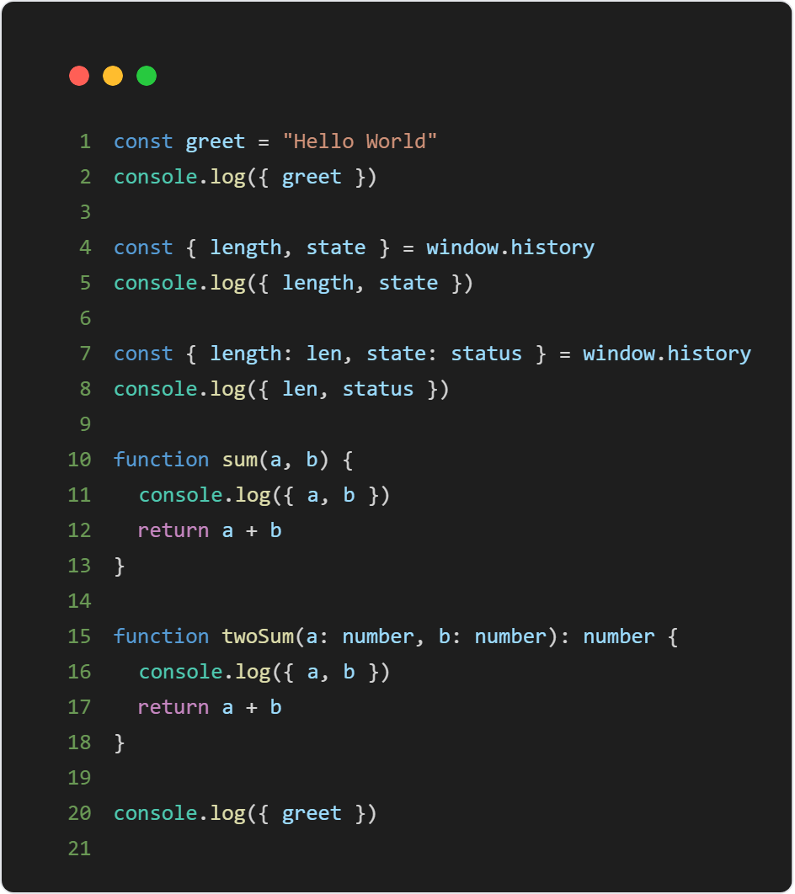

<p align="center">
  
</p>

<h1 align="center">
Quick Console
</h1>

<p align="center">
Quick operation for console.log variables anywhere.
</p>

## Features

|          origin          |     |          generate          |
| :----------------------: | :-: | :------------------------: |
|  | =>  |  |

- ✨ It can be used anywhere.
- 🍭 Quick generate console.log, single variable without Selection.
- 🌭 Multiple continuous variables like deconstruct assignment、params of function with selection.
- 🎉 Quick clear all console.log in the active file.
- 🍖 Quick toggle all console.log's state of comment in the active file.
- 🛠 Option for console variables in an object.
- 🛠 Option for console log variables name.

## Usage

### Quick generate console.log

#### Single variable without Selection

- Move the cursor near in variable or word.
- Press `Cmd + Shift + L` (Mac) or `Ctrl + Shift + L` (Windows).
- Next line or current line will be:<br />
  console.log({ variable })

#### Multiple continuous variables with Selection

- Selected continuous variables or params of function.
- Press `Cmd + Shift + L` (Mac) or `Ctrl + Shift + L` (Windows).
- Next line will be: <br />
  console.log({ variable1, variable2 })<br />

### Quick clear all console.log

- Press `Cmd + Shift + K` (Mac) or `Ctrl + Shift + K` (Windows).

### Quick toggle all console.log's state of comment

- Press `Cmd + Shift + J` (Mac) or `Ctrl + Shift + J` (Windows).

## Options

### consoleInObject

- Type: `Boolean`
- Default: `true`

Console log variables in an object.

### consoleVariablesName

- Type: `Boolean`
- Default: `false`

Console log variables name.

## Vim keyBindings Setting

```json
"vim.visualModeKeyBindingsNonRecursive": [
  {
    "before": ["<leader>", "l"],
    "commands": [
      "quickConsole.createConsoleLog",
      "extension.vim_ctrl+["
    ]
  },
  {
    "before": ["<leader>", "k"],
    "commands": ["quickConsole.clearConsoleLog"]
  },
  {
    "before": ["<leader>", "j"],
    "commands": ["quickConsole.toggleConsoleLog"]
  }
],
"vim.normalModeKeyBindingsNonRecursive": [
  {
    "before": ["<leader>", "l"],
    "commands": ["quickConsole.createConsoleLog"]
  },
  {
    "before": ["<leader>", "k"],
    "commands": ["quickConsole.clearConsoleLog"]
  },
  {
    "before": ["<leader>", "j"],
    "commands": ["quickConsole.toggleConsoleLog"]
  }
]
```

✨ Happy hacking!

## License

MIT
