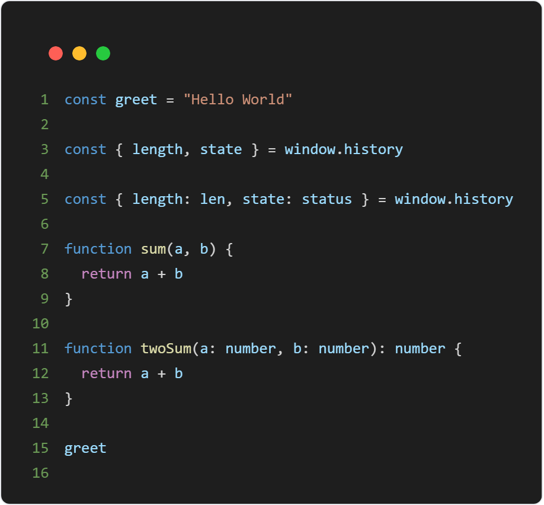

<p align="center">
  
</p>

<h1 align="center">
Quick Console
</h1>

<p align="center">
Quick generate console.log for variables with selection or not anywhere.
</p>

## Features

|          origin          |     |          generate          |
| :----------------------: | :-: | :------------------------: |
|  | =>  |  |

- 🧂 It's can be use anywhere.
- 🍭 Single variable without selection.
- 🌭 Multiple params of function with selection.
- 🌭 Multiple continuous variables like deconstruct assignment with selection.
- 🍖 Clear console.logs in the active file.
- 🛠 Improve the development experience with console variables in object.

## Usage

Without Selection

- Move the cursor near variable.
- Press `Cmd + Shift + L` (Mac) or `Ctrl + Shift + L` (Windows).
- Next line will be:<br />
  console.log('variable:', variable)

With Selection

- Selected continuous variables or params of function.
- Press `Cmd + Shift + L` (Mac) or `Ctrl + Shift + L` (Windows).
- Next line will be: <br />
  console.log('variable1:', variable1)<br />
  console.log('variable2:', variable2)

Clear console.logs

- Press `Cmd + Shift + K` (Mac) or `Ctrl + Shift + K` (Windows).

## Options

### consoleInObject

- Type: `Boolean`
- Default: `false`

Console log variables in object.

## Vim keyBindings Setting

```json
"vim.visualModeKeyBindingsNonRecursive": [
  {
    "before": ["<leader>", "l"],
    "commands": [
      "quickConsole.createConsoleLog",
      "extension.vim_ctrl+["
    ]
  },
  {
    "before": ["<leader>", "k"],
    "commands": ["quickConsole.clearConsoleLog"]
  }
],
"vim.normalModeKeyBindingsNonRecursive": [
  {
    "before": ["<leader>", "l"],
    "commands": ["quickConsole.createConsoleLog"]
  },
  {
    "before": ["<leader>", "k"],
    "commands": ["quickConsole.clearConsoleLog"]
  }
]
```

✨ Happy hacking!

## License

MIT
